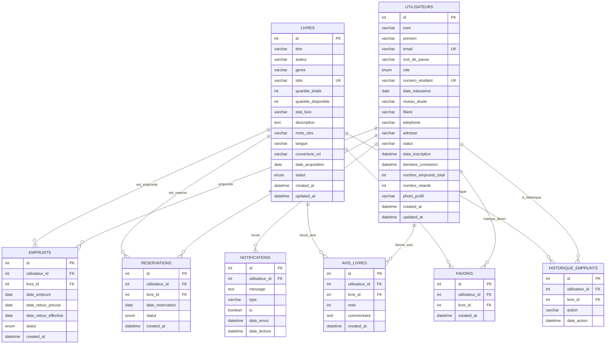

# Schéma Base de Données - Bibliothèque Universitaire

```mermaid
erDiagram
    UTILISATEURS {
        int id PK
        varchar nom
        varchar prenom
        varchar email UK
        varchar mot_de_passe
        enum role
        varchar numero_etudiant UK
        date date_naissance
        varchar niveau_etude
        varchar filiere
        varchar telephone
        varchar adresse
        varchar statut
        datetime date_inscription
        datetime derniere_connexion
        int nombre_emprunts_total
        int nombre_retards
        varchar photo_profil
        datetime created_at
        datetime updated_at
    }

    LIVRES {
        int id PK
        varchar titre
        varchar auteur
        varchar genre
        varchar isbn UK
        int quantite_totale
        int quantite_disponible
        varchar etat_livre
        text description
        varchar mots_cles
        varchar langue
        varchar couverture_url
        date date_acquisition
        enum statut
        datetime created_at
        datetime updated_at
    }

    EMPRUNTS {
        int id PK
        int utilisateur_id FK
        int livre_id FK
        date date_emprunt
        date date_retour_prevue
        date date_retour_effective
        enum statut
        datetime created_at
    }

    RESERVATIONS {
        int id PK
        int utilisateur_id FK
        int livre_id FK
        date date_reservation
        enum statut
        datetime created_at
    }

    AVIS_LIVRES {
        int id PK
        int utilisateur_id FK
        int livre_id FK
        int note
        text commentaire
        datetime created_at
    }

    FAVORIS {
        int id PK
        int utilisateur_id FK
        int livre_id FK
        datetime created_at
    }

    NOTIFICATIONS {
        int id PK
        int utilisateur_id FK
        text message
        varchar type
        boolean lu
        datetime date_envoi
        datetime date_lecture
    }

    HISTORIQUE_EMPRUNTS {
        int id PK
        int utilisateur_id FK
        int livre_id FK
        varchar action
        datetime date_action
    }

    UTILISATEURS ||--o{ EMPRUNTS : emprunte
    LIVRES ||--o{ EMPRUNTS : est_emprunte
    UTILISATEURS ||--o{ RESERVATIONS : reserve
    LIVRES ||--o{ RESERVATIONS : est_reserve
    UTILISATEURS ||--o{ AVIS_LIVRES : donne_avis
    LIVRES ||--o{ AVIS_LIVRES : recoit_avis
    UTILISATEURS ||--o{ FAVORIS : marque_favori
    LIVRES ||--o{ FAVORIS : est_favori
    UTILISATEURS ||--o{ NOTIFICATIONS : recoit
    UTILISATEURS ||--o{ HISTORIQUE_EMPRUNTS : a_historique
    LIVRES ||--o{ HISTORIQUE_EMPRUNTS : dans_historique
```